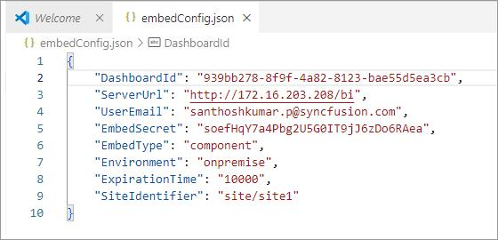
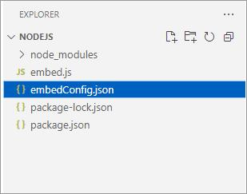

# Bold BI Embedded Sample in React Native CLI with Node.js

This Bold BI React Native CLI sample, using Node.js, includes examples of dashboard embedding. In this sample, the React Native CLI application serves as the front end, while Node.js acts as the back end. The purpose of this application is to demonstrate how to render the dashboard available on your Bold BI server.

## Dashboard View

## Requirements/Prerequisites

* [Visual Studio Code](https://code.visualstudio.com/download)
* [Node.js](https://nodejs.org/en/)
* [Java Development Kit (JDK)](https://www.oracle.com/java/technologies/javase/jdk17-archive-downloads.html)
* [Android Studio](https://developer.android.com/studio)

> **NOTE:** Node.js versions 12.13 to 18.18 are supported.

### Supported Browsers
  
* Google Chrome
* Microsoft Edge
* Mozilla Firefox

## Configuration

* Please ensure that you have enabled embed authentication on the `embed settings` page. If it is not currently enabled, refer to the following image or detailed [instructions](https://help.boldbi.com/site-administration/embed-settings/#get-embed-secret-code?utm_source=github&utm_medium=backlinks) to enable it.

    

* To download the `embedConfig.json` file, please follow this [link](https://help.boldbi.com/site-administration/embed-settings/#get-embed-configuration-file?utm_source=github&utm_medium=backlinks) for reference. Additionally, you can refer to the following image for visual guidance.

    
    

* Copy the downloaded `embedConfig.json` file and paste it into the designated [location](https://github.com/boldbi/vue-with-nodejs-sample/tree/master/Nodejs) within the application. Please ensure that you have placed it in the correct location, as shown in the following image.

    

> **NOTE:** The mobile application cannot connect to a server hosted on your computer using localhost. To enable users to access Bold BI using a custom domain name, please refer to the instructions on [changing the binding for Bold BI in Windows using a domain name](https://support.boldbi.com/kb/article/13555/how-to-change-the-binding-for-bold-bi-in-windows-using-a-domain-name-with-an-ssl-certificate).

### Run Node.js Using Visual Studio Code

* Open the `Nodejs` sample in **Visual Studio Code**.

* To install all dependent packages, use the command `npm install`.

* Then, run the back-end `Node.js` sample using the command `node embed.js`.

> **NOTE:** If the API host is already in use, modify the port number in `embed.js` according to your preference, and update `App.js` in the React Native application accordingly.

### Run the React Native CLI Application Using Android Studio

* Open the `React Native CLI` project in **Android Studio**.

* To install all dependent packages, use the command `npm install`.

* Add a virtual device and run the metro bundler in the terminal using the command `npx react-native start`.

* Finally, run the sample in the Android emulator using the command `npx react-native run-android`.

## Important Notes

In a real-world application, it is recommended not to store passwords and sensitive information in configuration files for security reasons. Instead, consider using a secure application, such as Key Vault, to safeguard your credentials.

## Online Demos

Check out the live demo of the Bold BI Embedding sample [here](https://samples.boldbi.com/embed?utm_source=github&utm_medium=backlinks).

## Documentation

Comprehensive Bold BI Embedding documentation can be found on the [Bold BI Embedding Help](https://help.boldbi.com/embedded-bi/javascript-based/?utm_source=github&utm_medium=backlinks) page.